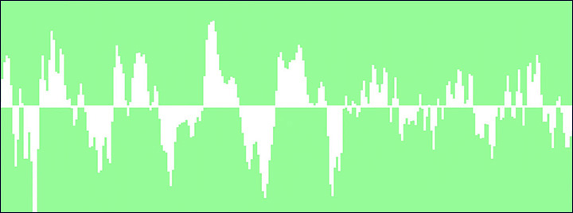

# Making Sound Sculptures in OpenFrameworks

A bit of explanation of what this is about.

## Audio Input from Microphone.

The very first thing we need to learn when making anything react to audio in OpenFrameworks, is how to first receive audio data from the real world via a microphone or from an audio file and then how to translate that data into something that we can use.

##### Audio Input from Microphone example.

This OF example is available here,
[https://github.com/julapy/SoundSculptures/tree/master/01_audioInputFromMic](https://github.com/julapy/SoundSculptures/tree/master/01_audioInputFromMic)


````
int channelsOut = 0;
int channelsIn = 2;
int sampleRate = 44100;
int bufferSize = 256;
int numOfBuffers = 4;

soundStream.setup(this, channelsOut, channelsIn, sampleRate, bufferSize, numOfBuffers);
````

````
void ofApp::audioIn(float * input, int bufferSize, int nChannels) {
	for(int i = 0; i<bufferSize; i++) {
		samplesChannelL[i] = input[i * 2 + 0];
		samplesChannelR[i] = input[i * 2 + 1];
	}
}
````

## Fast Fourier Transforms (FFT)

Fast Fourier transform (FFT) is an algorithm which can be used to convert a singnal from a time domain to a frequency domain. In digital audio processing this is particularly handy as it makes it easier to analyse and visualise the audio.

The image below shows a raw audio signal from the previous OF example where the audio is plotted over the time domain. Using FFT the audio is transformed so that it can be plotted over the frequency domain, which gives us a spectrum analyser visualisation of the sound.




##### ofxFFT

[ofxFFT](https://github.com/julapy/ofxFFT) is a OF addon created by @julapy used to perform FFT computation on audio data. It also normalises the data so that all data returned is between 0 and 1, which makes it easy to use in a controlled manner. ofxFFT can also visualise the FFT data by drawing the spectrum to screen.

ofxFFT is split into two different classes that you would use inside your project,
ofxFFTLive and ofxFFTFile. ofxFFTLive will automatically setup a input stream from the computer microphone where ofxFFTFile is used to load a audio from disk, like mp3 and wave files, and both will compute the FFT from those sources.

Another class included in the ofxFFT addon is ofxFFTBase which can be used if you need to setup your audio input streams in a specific or custom way. ofxFFTLive and ofxFFTFile both extend ofxFFTBase.

TODO
- threshold
- peak decay
- max decay
- mirror
- norm data / peak data / glitch data

There are 3 examples included in ofxFFT which demonstrate how the addon can be used.

````
ofxFFT/example_osx
ofxFFT/example_ios
ofxFFT/example_advanced
````

## ofMesh

- description of ofMesh and what it does?
- creating custom meshes.
- vertices / normals / texture coordinates / indices
- triangles / strips / fans
- OF primitive objects.
- ofxAssimpModelLoader

## Audio Mesh

- using audio to displace mesh along the mesh normals.

## Mesh Export to 3d file format

[ofxObjLoader](https://github.com/satoruhiga/ofxObjLoader.git) is a great OF addon by @satoruhiga which can easily export a mesh into a .obj 3d file format which can be read by other 3d software.

The syntax for exporting a mesh is very simple and can be seen below. You just need to give the file you are exporting a name and pass it the mesh you want to export.


````
ofMesh mesh;
ofxObjLoader::save("mesh.obj", mesh);
````